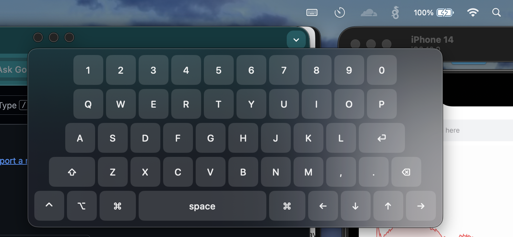

# Mac Keyboard Bar

A macOS menu bar utility that provides a floating on-screen keyboard. Type from the couch using only a wireless mouse — keys are injected into the frontmost app via macOS Accessibility APIs.



## Features

- **Menu bar app** — lives next to Wi-Fi/Battery icons, no Dock icon
- **Floating keyboard panel** — draggable, non-activating window that never steals focus
- **Keystroke injection** — uses `CGEvent` to post keystrokes to the active app
- **Modifier keys** — Shift, Command, Option, Control with sticky toggle (auto-clears after next key)
- **Position memory** — remembers window location across launches
- **QWERTY layout** — 5 rows, 40+ keys including arrows and navigation

## Requirements

- macOS 13.0+
- Xcode 16+
- Swift 5.0
- **Accessibility permission** (prompted on first launch)

## Build & Run

```bash
# Clone
git clone https://github.com/jerrypm/mac-keyboard-bar.git
cd mac-keyboard-bar

# Build
xcodebuild -project mac-keyboard-bar.xcodeproj \
  -scheme mac-keyboard-bar \
  -configuration Debug build

# Run
open build/Debug/mac-keyboard-bar.app
```

Or open `mac-keyboard-bar.xcodeproj` in Xcode and hit **Run**.

## Usage

1. App launches — keyboard icon appears in menu bar
2. System prompts for **Accessibility permission** — grant it
3. **Left-click** menu bar icon to toggle keyboard
4. Focus any app (TextEdit, browser, etc.)
5. Click keys on floating keyboard — text appears in focused app
6. **Right-click** menu bar icon for Show/Hide/Quit

## Running Tests

```bash
xcodebuild test -project mac-keyboard-bar.xcodeproj \
  -scheme mac-keyboard-bar \
  -destination 'platform=macOS'
```

## Architecture

VIPER pattern with two modules:

```
├── Modules/
│   ├── Keyboard/    # Presenter → Interactor → Services (key injection)
│   └── MenuBar/     # Status item, toggle, quit
├── Services/
│   ├── AccessibilityService      # AXIsProcessTrusted wrapper
│   ├── KeyInjectionService       # CGEvent posting
│   └── WindowPositionService     # UserDefaults persistence
├── UI/
│   ├── KeyboardView              # SwiftUI root
│   ├── KeyRowView                # Row of keys
│   └── KeyButtonView             # Individual key
└── Entities/
    ├── KeyDefinition             # Key metadata
    ├── KeyboardLayout            # QWERTY layout data
    └── ModifierState             # Modifier flags
```

## Important Notes

- **No App Sandbox** — `CGEvent.post(tap: .cghidEventTap)` requires sandbox disabled
- **Accessibility required** — without permission, keys won't inject
- **Non-activating panel** — `FloatingPanel` overrides `canBecomeKey = false` so target app keeps focus

## License

MIT
